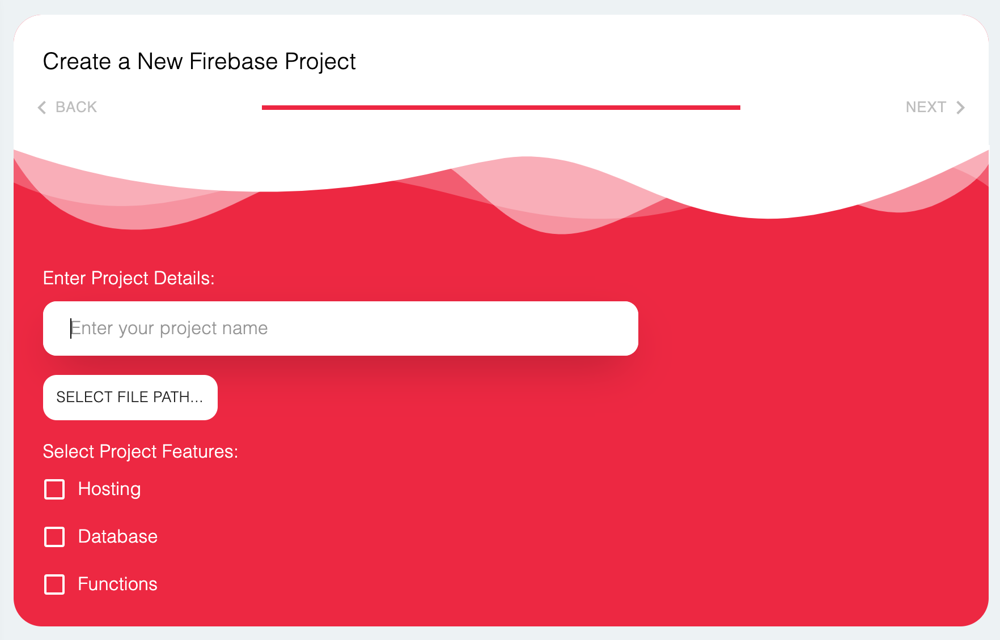
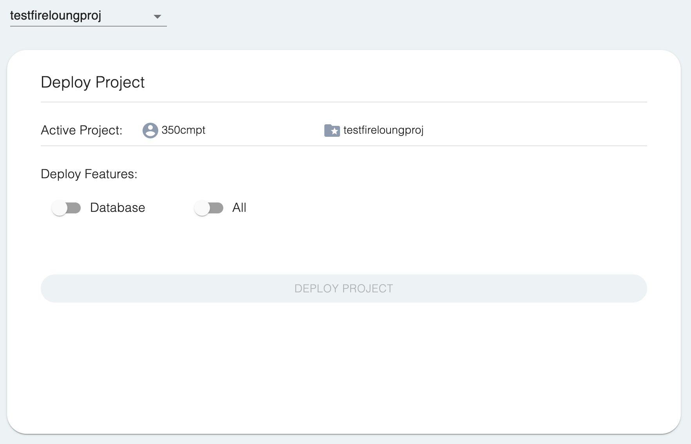
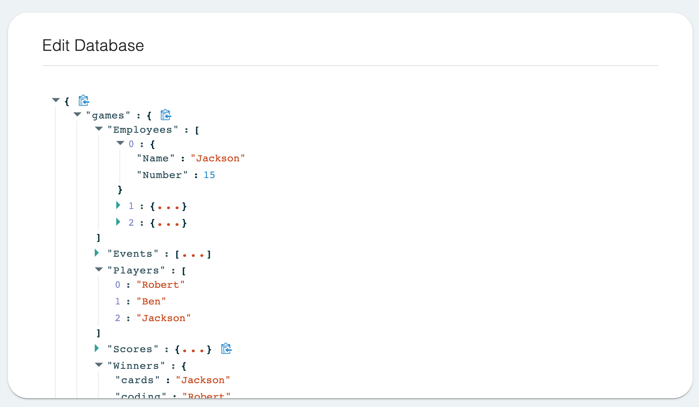
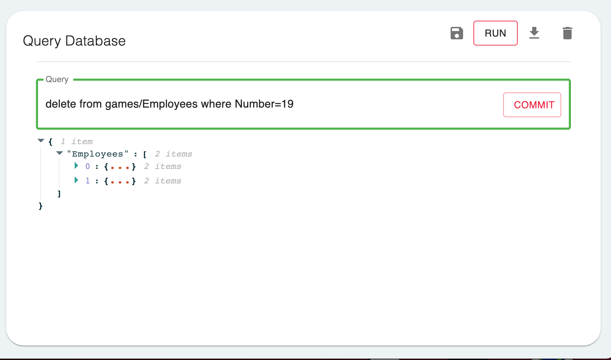

# FireLounge

### Table of Contents
- [About the Project](#about-the-project)
- [Usage](#usage)
    - [Getting Started](#getting-started) 
    - [Creating a New Firebase Project](#creating-a-new-firebase-project) 
    - [Add an Existing Firebase Project](#add-an-existing-firebase-project)
    - [Firebase Project Management](#firebase-project-management)
    - [Database Management](#database-management)
    - [Database Queries](#database-queries)
- [Contributors](#contributors)
- [Credits](#credits)

## About the Project
- FireLounge is an application that allows developers to quickly create, connect and manage their Firebase applications. 
Specifically, it allows users to run SQL style queries to perform CRUD operations on Firebase RealTime databases.

## Usage

### Getting Started
```
git clone https://github.com/robertstef/Firelounge.git
cd Firelounge && npm install

#run in development mode
npm run start

#build executable
npm run build
```

### Creating a New Firebase Project
- Creating a new Firebase project through FireLounge is done using an basic step-by-step process. 
Each step contains the necessary fields required for each respective Firebase feature. Currently, 
FireLounge supports project creation with Database, Hosting, and Functions features. The project
creation stepper can be found under the Creation tab denoted by the pencil icon. 



### Add an Existing Firebase Project

### Firebase Project Management
- Users are able to manage their Firebase projects through FireLounge. Project management can accessed through 
the Management tab denoted by a briefcase icon. In addition, users are able to deploy all of the features on the 
project or a select set of features from their selected project through FireLounge. 



### Database Management
- Users are able easily manage their Firebase databases right in FireLounge using the provided user interface. This interface
gives users the ability to perform basic CRUD operations on the currently selected  Firebase database. 



### Database Queries
- Within FireLounge users have the capability to query their databases using MySQL syntax on the NoSQL Firebase database.
You enter your query and the corresponding result of that query will be displayed. 
When performing an UPDATE or DELETE query the object that gets display is what the following change will result in on that specific object being queried.
This allows the user to view the proposed changes before they occur. 
One the 'COMMIT' button in the input section is clicked the following change is executed and applied on the Database. 
Current supported MySQL statements are, SELECT, UPDATE, and DELETE.



## Contributors
- Jackson Schuler (https://github.com/jacksonschuler)
- Benjamyn Baker (https://github.com/BenjamynBaker)
- Robert Stefanyshin (https://github.com/robertstef)


## Credits
- Joseph Roddy (https://github.com/JoeRoddy) for his Firebase SQL library (https://www.npmjs.com/package/fbsql)
